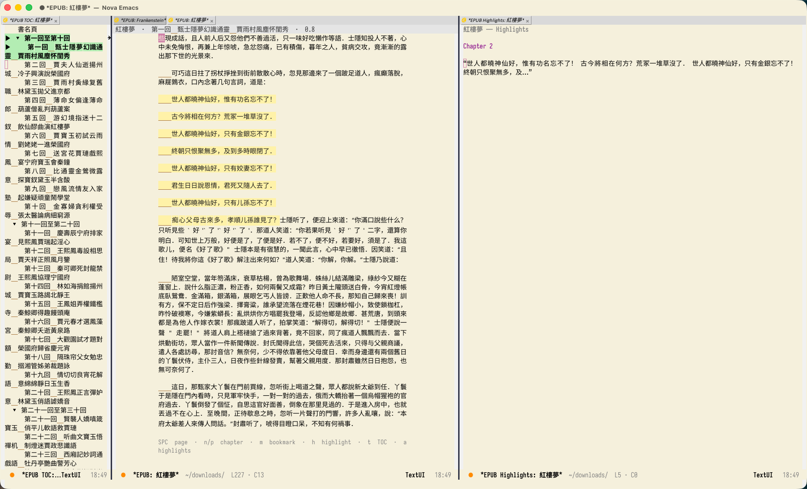
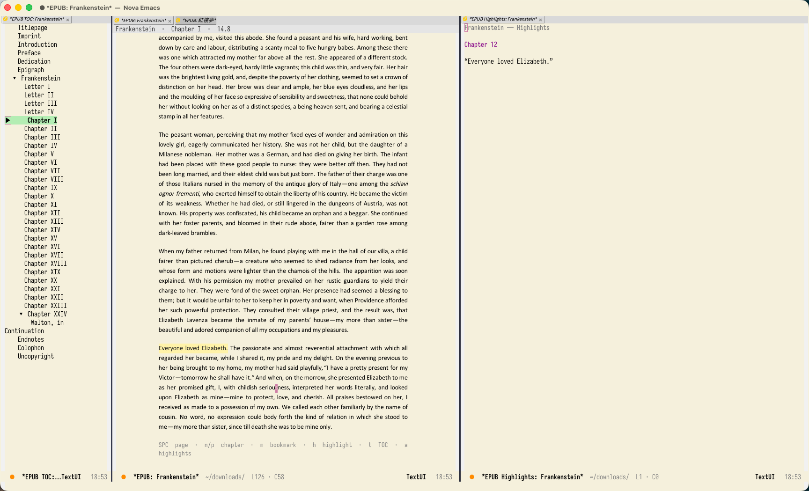

[English](README.md) | [中文](README_cn.md)

# epub-reader

`epub-reader` 是一个基于 TextUI 布局层的原生 Emacs EPUB
阅读器。它直接解析 EPUB 的 OCF、OPF、spine 与目录文档，把 XHTML 转成语义块，再由
TextUI 按窗口宽度排版；除 TextUI 和系统归档命令外不引入重型依赖。

与 nov.el 的差异可以概括为一句话：nov.el 以 `shr` 显示整章 HTML，而本项目以自有 EPUB
模型、稳定 locator 和 TextUI 的宽度感知 frame/分块 viewport 组织阅读体验。逐项对比见
[与 nov.el 的比较](#与-novel-的比较)。

当前版本为 0.2.0，面向无 DRM、可重排（reflowable）的 EPUB 2/3。





左侧为目录，中间为正文阅读栏，右侧为高亮列表。示例文本为 Project Gutenberg 的《紅樓夢》
和 Standard Ebooks 的《Frankenstein》，均属公有领域。

## 与 nov.el 的比较

`nov.el` 是成熟、打包广、经过更多书籍验证的选择；`epub-reader` 还很年轻，但它不是
把整章 HTML 一次性显示到 buffer 里，而是为阅读位置、长章分块和 CJK 重排单独建模。

| 项目 | nov.el 0.5 | epub-reader 0.2.0 |
|---|---|---|
| 渲染 | 通过 `shr` 显示完整 spine 文档 | XHTML 先转成语义块，再由 TextUI 排版当前视区 |
| 窗口变宽、字号变化 | 通常需要重新渲染，buffer 位置可能移动 | 自动重排，并回到同一语义位置 |
| CJK 正文 | 往往要自行组合行宽、visual-line 和禁则设置 | 内置常见行首/行尾禁则、语言感知空白处理和非末行两端对齐 |
| 长章与大图 | 整章工作可能阻塞界面 | 小首绘、按需资源、延后图片和下一章预取 |
| 阅读位置 | spine 序号加 buffer 位置 | 版本化 locator，并可用原文片段降级恢复 |
| 目录 | 独立 TOC 视图 | 多级折叠、当前章节标记、重开恢复选中行 |
| 书签与标注 | 无内置模型，但可接 `org-remark` 等成熟工作流 | 内置本地书签、高亮、纯文本笔记和列表，暂无 Org/Web Annotation 互操作 |
| 安装与兼容性 | 包仓库安装，现实 EPUB 覆盖更广 | 当前需本地 checkout TextUI，真书样本面还较小 |

如果你更在意成熟度、包管理器安装或现有标注生态，先用 `nov.el`；如果你更在意 CJK
默认排版、长章响应、字号变化后的位置恢复，可以试 `epub-reader`。两者同时安装没有冲突。

## 安装

要求：

- Emacs 29.1 或更高版本，且编译时带 libxml2 支持；
- TextUI 0.5.1 或更高版本；
- `unzip` 或 `bsdtar`，安装任意一个即可。两者都存在时默认先尝试 `unzip`。

两个包都还没有进入软件源。Emacs 29.1 起自带的 `package-vc-install` 可以直接从 GitHub
安装。先装 TextUI，再装本项目：

```elisp
(package-vc-install "https://github.com/yibie/textui")
(package-vc-install "https://github.com/yibie/epub-reader")
```

也可以克隆两个仓库后加入 `load-path`：

```elisp
(add-to-list 'load-path "/path/to/textui")
(add-to-list 'load-path "/path/to/epub-reader")
(require 'epub-reader)
```

如果 Emacs 找不到归档命令，请先确认 `(executable-find "unzip")` 或
`(executable-find "bsdtar")` 返回非 `nil`。

## 快速上手

运行：

```text
M-x epub-reader-open RET /path/to/book.epub RET
```

打开后阅读 buffer 独占整个 frame，显示居中的正文栏，按 `q` 关闭并恢复原来的窗口布局；
调整窗口宽度时，TextUI 会重新排版并尽量保持当前语义位置。
默认启用进度保存。阅读进度、书签、高亮和笔记写在 EPUB 旁边的
`BOOK.epub.epub-reader`，可通过 `epub-reader-store-directory` 改到集中目录；原 EPUB
文件不会被修改。

### 阅读键位

| 键 | 动作 |
|---|---|
| `n` / `]` | 下一 spine 章节 |
| `p` / `[` | 上一 spine 章节 |
| `SPC` | 向后翻页；到章尾时自动进入下一章 |
| `S-SPC` | 向前翻页；到章首时进入上一章末尾 |
| `b` / `f` | locator 导航历史后退 / 前进 |
| `t` | 打开层级目录 buffer |
| `g` | 用 `completing-read` 按目录标题跳转 |
| `m` | 在当前位置添加书签，可输入简短名字 |
| `M` | 打开书签列表 |
| `h` | 高亮当前选中的文字 |
| `e` | 查看或编辑光标所在高亮的笔记 |
| `a` | 打开高亮与笔记列表 |
| `RET` | 打开 point 所在的内部或允许的外部链接 |
| `q` | 保存进度、关闭阅读 buffer 并恢复之前的窗口布局 |

目录 buffer 中，`RET` 跳转（无目标的分组则折叠/展开），`TAB` 折叠/展开当前分组，`q`
隐藏目录。鼠标点击条目等同于 `RET`。目录重开后会恢复先前选中的行。

### 书签与标注

在同一章内选中文字后按 `h` 即可高亮；光标放在高亮上按 `e`，可以添加、查看或修改纯文本
笔记。`M` 和 `a` 打开的列表使用以下键位：

| 列表 | `RET` | `d` | `e` | `q` |
|---|---|---|---|---|
| 书签 | 跳到书签 | 删除 | — | 隐藏列表 |
| 高亮与笔记 | 跳到引文 | 删除 | 编辑笔记 | 隐藏列表 |

鼠标点击列表中的条目等同于 `RET`，直接跳转。

窗口宽度、字号或字体变化后，高亮会跟随原文恢复。如果精确位置已经找不到，reader 会按保存的
引文重新定位，并用波浪下划线和列表中的警告标记提醒你检查位置。

## Customize

运行 `M-x customize-group RET epub-reader RET` 查看全部选项和 faces。常用项如下：

| 用途             | 变量                                                                                                                                                                                                                                                                                                                                                                |
|------------------|---------------------------------------------------------------------------------------------------------------------------------------------------------------------------------------------------------------------------------------------------------------------------------------------------------------------------------------------------------------------|
| 正文与图片       | epub-reader-reading-width、epub-reader-image-rows、epub-reader-text-wrap-strategy                                                                                                                                                                                                                                                                                   |
| 字体与间距       | epub-reader-text-scale、epub-reader-line-spacing、epub-reader-paragraph-spacing                                                                                                                                                                                                                                                                                     |
| 窗口布局         | epub-reader-open-full-frame |
| 交互首绘         | epub-reader-first-paint-max-blocks、epub-reader-first-paint-max-characters                                                                                                                                                                                                                                                                                          |
| 冷滚动 chunk     | epub-reader-scroll-chunk-max-blocks、epub-reader-scroll-chunk-max-characters                                                                                                                                                                                                                                                                                        |
| 后台预取         | epub-reader-background-idle-delay                                                                                                                                                                                                                                                                                                                                   |
| 长章 viewport    | epub-reader-chunk-max-blocks、epub-reader-chunk-max-characters、epub-reader-chunk-guard-blocks、epub-reader-chunk-overscan-screens                                                                                                                                                                                                                                  |
| 进度保存         | epub-reader-enable-progress、epub-reader-save-idle-delay、epub-reader-store-directory                                                                                                                                                                                                                                                                               |
| store 锁         | epub-reader-store-lock-timeout、epub-reader-store-ownerless-lock-grace                                                                                                                                                                                                                                                                                              |
| 链接策略         | epub-reader-external-link-schemes，默认只允许 http、https、mailto                                                                                                                                                                                                                                                                                                   |
| locator 降级范围 | epub-reader-locator-max-synthetic-distance、epub-reader-locator-max-synthetic-rows                                                                                                                                                                                                                                                                                  |
| 归档 adapter     | epub-reader-container-adapters                                                                                                                                                                                                                                                                                                                                      |
| 归档安全上限     | epub-reader-container-max-entries、epub-reader-container-max-files、epub-reader-container-max-directories、epub-reader-container-max-central-directory-bytes、epub-reader-container-max-path-bytes、epub-reader-container-max-entry-bytes、epub-reader-container-max-total-bytes、epub-reader-container-max-compression-ratio、epub-reader-container-member-timeout |

### 字体、字号与间距

要换阅读字体或基础字号，运行
`M-x customize-face RET epub-reader-prose-face RET`；标题会继承正文 face，并保留各自的
相对字号。临时放大、缩小或复原可用 `C-x C-+`、`C-x C--`、`C-x C-0`，reader 会自动
重排。每次打开书时的默认缩放由 `epub-reader-text-scale` 控制，正文行距由
`epub-reader-line-spacing` 控制，段落之间的空行数由
`epub-reader-paragraph-spacing` 控制，阅读栏宽度则由 `epub-reader-reading-width` 控制。

```elisp
(setq epub-reader-text-scale 1
      epub-reader-line-spacing 0.2
      epub-reader-paragraph-spacing 1
      epub-reader-reading-width 72)
```

强调、引用、代码、链接、高亮、图片提示、header/footer 和目录状态也都有
`epub-reader-*` face，可通过 `M-x customize-face` 调整。

## 功能矩阵

| 状态   | 能力                  | 0.2.0 行为                                                                                                                                                                                                                 |
|--------|-----------------------|----------------------------------------------------------------------------------------------------------------------------------------------------------------------------------------------------------------------------|
| 已支持 | EPUB 容器与出版物模型 | 打开无 DRM 的 reflowable EPUB 2/3；中央目录安全 preflight 后按需解压 metadata、当前 spine 与当前 chunk 图片；解析 EPUB 2 NCX 与 EPUB 3 nav                                                                                 |
| 已支持 | 常见 XHTML 语义       | 段落、标题、强调、链接、引用、代码、无序/有序列表、简单表格的文本降级、异步后到图片与可见错误提示                                                                                                                          |
| 已支持 | CJK 与宽度重排        | TextUI 宽度感知折行、common kinsoku 与非末行两端对齐；默认 greedy 线性选断点，亦可选 balanced KP；窗口宽度、主题、字体或 text scale 变化时失效旧布局，并通过 focus/source anchor 保持位置；图片行预算跟随 remap 后字体高度 |
| 已支持 | 长章节                | 首绘/冷滚动小 chunk、block 数与字符数双软预算、guard/overscan、章节 region refresh；idle 扩展 viewport 并预取下一章，不会为整章预先生成 TextUI leaf/source property                                                        |
| 已支持 | 导航                  | 前后章、章尾自动前进、内部 fragment、外部链接 allowlist、history back/forward、层级/可折叠 TOC、标题补全跳转                                                                                                               |
| 已支持 | 进度                  | 基于书籍 fingerprint 的版本化 locator；位置变化后 idle debounce、换章与关闭保存；原子 merge/write；exact/degraded 恢复提示；全书加权百分比                                                                                 |
| 已支持 | 书签与标注            | 命名书签；同一章内的连续文字高亮；纯文本笔记；可跳转、编辑和删除的列表；重排或来源位置变化后按引文恢复                                                                                                                     |
| 已支持 | 输入安全              | OCF 路径规范化与冲突检查、归档成员/大小/压缩比限制、逐成员流式提取、远程资源隔离、外链 scheme allowlist                                                                                                                    |
| 不支持 | 受限或固定版式出版物  | DRM、fixed-layout、竖排与精确分页                                                                                                                                                                                          |
| 不支持 | 富媒体与复杂排版      | 复杂 ruby、MathML、SVG、音视频、JavaScript、通用 CSS、publisher font、float/grid fidelity                                                                                                                                  |
| 不支持 | 全书服务              | 索引式全文搜索、跨设备同步、EPUB CFI 或 Web Annotation 互操作                                                                                                                                                              |
| 不支持 | 纯 Elisp ZIP          | 0.2.0 仍通过 unzip/bsdtar adapter 流式读取归档                                                                                                                                                                             |

## 已知限制

- 一处高亮不能跨过两个章节文件。如果选区跨章，需要在两章里分别添加高亮。
- 极长的单个段落（几万字不分段的那种）会一次性载入渲染，翻到这种段落时可能出现一次
  明显的停顿。
- 极端内容可能出现行尾被截断而不是换行：比如一条特别长且中间没有任何可断点的
  URL，或个别特别宽的字形。正常文字不受影响。
- header 里的全书百分比是按各章文件大小估算的近似值，不是精确的字数比例；读到书末
  会到 100%，但中途的数值只当参考。
- 阅读进度文件（sidecar）的多开保护只在本地磁盘上可靠。如果把书和进度文件放在网盘
  或同步盘上、并且多台机器同时读同一本书，进度可能互相覆盖，保存也可能要等几秒锁
  超时。单机使用不受影响。
- Emacs 崩溃或被强杀后，进度目录里可能留下残余的锁文件或临时目录。目前不会自动清
  理，后续保存会自动等待并重试；如果发现保存一直变慢，手动删掉进度目录里陈旧的
  `*.lock` 类残留即可。

## 开发

测试脚本会重建最小 EPUB2/3、CJK、英文、中英混排、长章和 adversarial fixtures，然后用 `emacs -Q --batch`
运行全部 ERT：

```sh
./test/run-tests.sh
```

TextUI 不在默认开发路径时：

```sh
TEXTUI_DIR=/path/to/textui ./test/run-tests.sh
```

也可以用 `EMACS=/path/to/emacs` 指定 Emacs。生产模块应保持只调用 TextUI 公开 API；修改后至少
运行全量 ERT、byte-compile，并用一本文本型 EPUB 做只读 smoke test。

## 许可证

epub-reader 以 GPL-3.0-or-later 发布，全文见 [`COPYING`](COPYING)。
